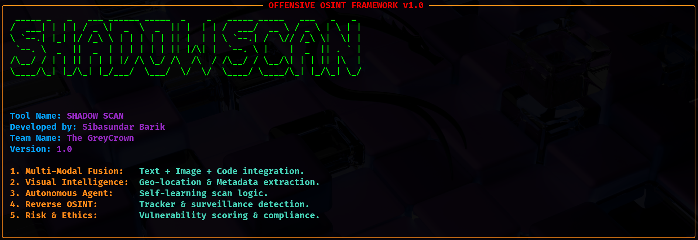
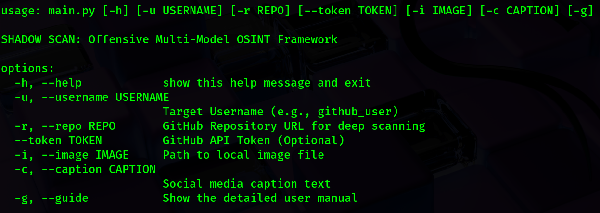
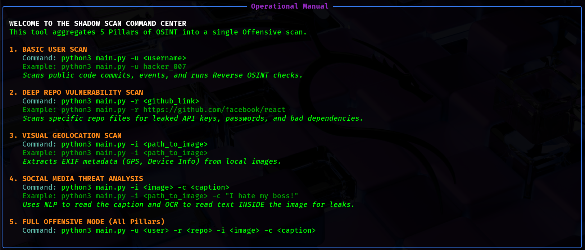

# 🕵️ ShadowScan: Offensive OSINT Framework

> **A Multi-Model Autonomous Intelligence Engine for Red Teaming.** > _Scan Code, Images, and Social Media for hidden risks, secrets, and behavioral anomalies._


## ⚡ Overview

**ShadowScan** is a recursive reconnaissance tool designed for offensive security operations. Unlike traditional scanners that only look at text, ShadowScan fuses three intelligence domains:

1.  **Code Intelligence (SAST):** Hunts for hardcoded secrets (`AKIA...`), weak configs, and logical flaws.
2.  **Visual Intelligence (OCR/EXIF):** Extracts hidden text and metadata from images.
3.  **Social Intelligence (NLP):** Analyzes sentiment and behavioral patterns to detect insider threats.

---

## 🚀 Installation (Optimized for Kali Linux)

These steps are specifically tuned to save disk space and prevent installation errors on Virtual Machines.

```bash
# 1. Clone the Repository
git clone https://github.com/Siba-Ka-Playground/ShadowScan.git
cd ShadowScan

# 2. Set up Virtual Environment (Recommended)
python3 -m venv venv
source venv/bin/activate

# 3. Install lightweight AI engine
pip install torch torchvision torchaudio --index-url [https://download.pytorch.org/whl/cpu](https://download.pytorch.org/whl/cpu)

# 4. Install Dependencies
pip install -r requirements.txt --no-cache-dir

# 5. Download Language Models
pip install https://github.com/explosion/spacy-models/releases/download/en_core_web_sm-3.8.0/en_core_web_sm-3.8.0-py3-none-any.whl --no-cache-dir

```

## 🚀 Run ShadowScan in Kali Linux



Follow the Steps to perform your first scan with ShadowScan.

```bash
# 1. Activate Virtual Environment
source venv/bin/activate
```



```bash
# 2. Open Help Menu
python3 main.py -h
```



```bash
# 3. Open Guide Menu
python3 main.py -g
```

### Now you are all done, follow the GUIDE MENU to use ShadowScan smoothly. <br>

## ⚠️ Disclaimer

FOR EDUCATIONAL & AUTHORIZED USE ONLY.<br> This tool is designed for security professionals and researchers to audit their own systems or systems they have explicit permission to test. The authors are not responsible for any misuse of this tool.<br>

## 📜 License

This project is licensed under the **GNU GPLv3 License**.<br>
You are free to use, modify, and distribute this software, but all modifications must remain open-source. <br>
**Copyright © 2026 Sibasundar Barik**
